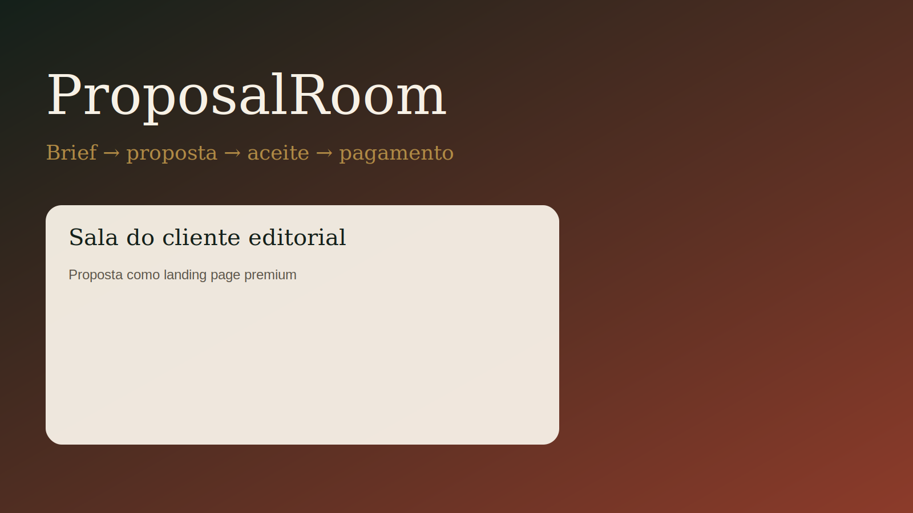
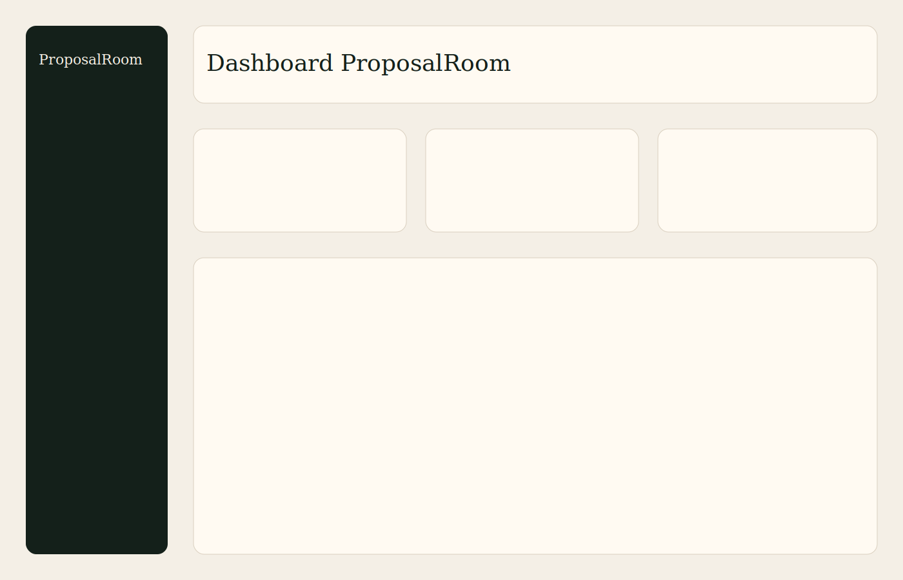
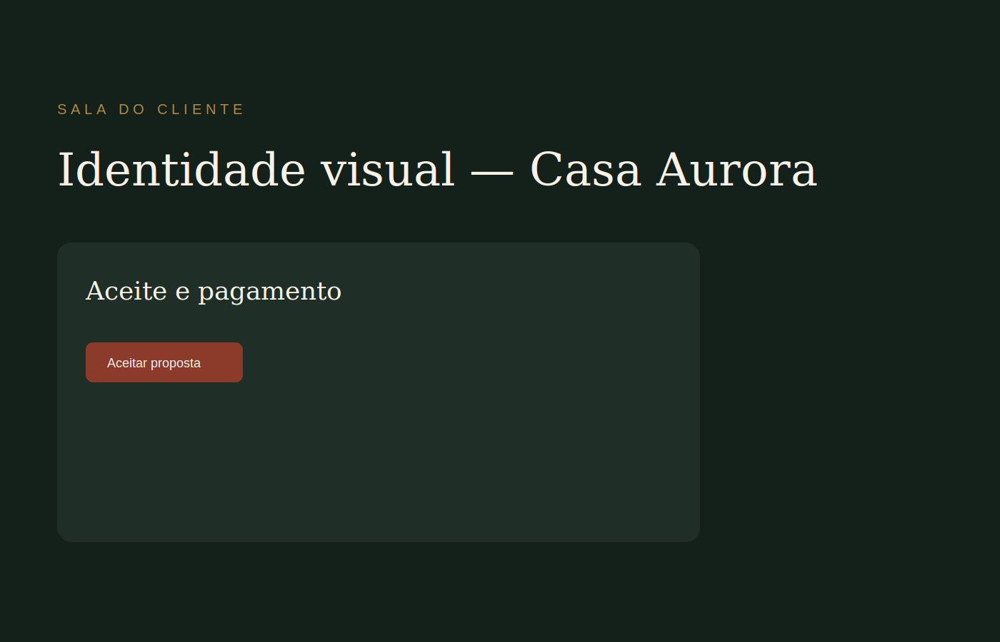
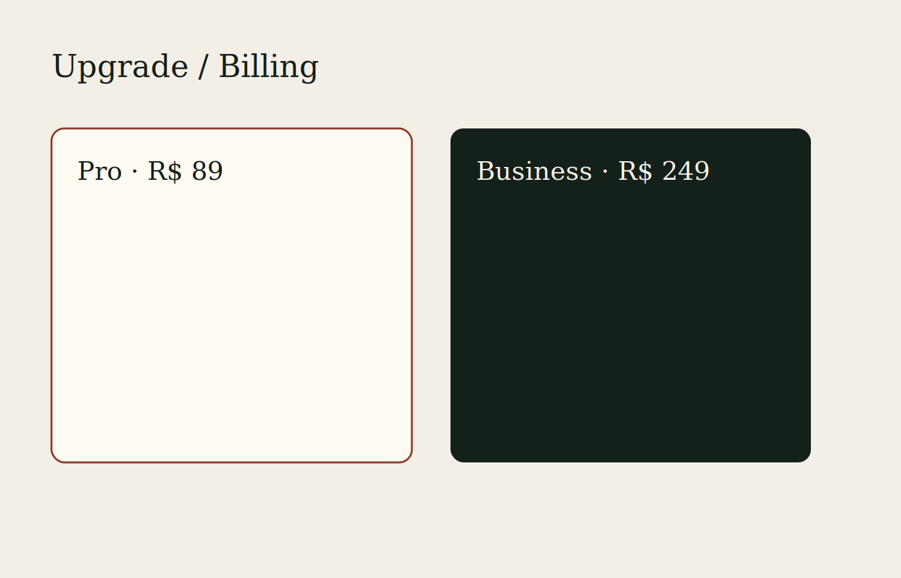
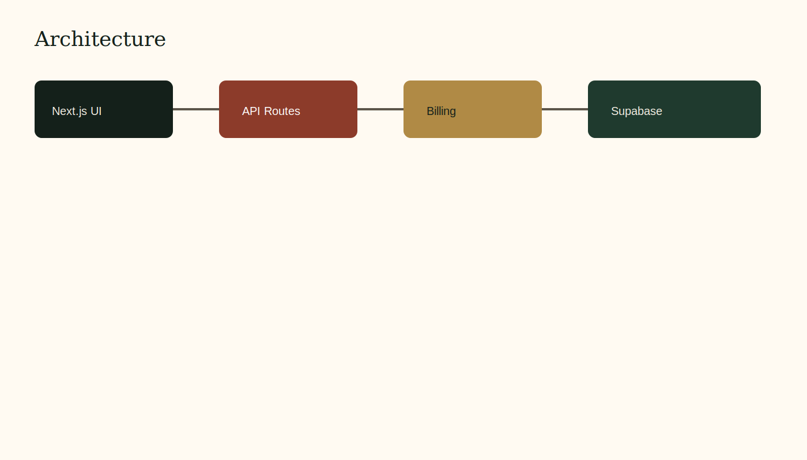

<div align="center">
  

  <h1>ProposalRoom</h1>

  <p><strong>Gerador de propostas comerciais com sala do cliente, aceite digital, follow-up e cobrança pronta.</strong></p>
  <p><strong>Commercial proposal generator with client room, digital acceptance, follow-up and billing-ready SaaS.</strong></p>

  <p>
    <a href="#1-visão-geral--overview">PT-BR / English Overview</a> •
    <a href="#-product-preview">Preview</a> •
    <a href="#-screenshots">Screenshots</a> •
    <a href="#️-stack--tecnologias">Stack</a> •
    <a href="#-arquitetura--architecture">Architecture</a> •
    <a href="#-quick-start--início-rápido">Quick Start</a> •
    <a href="#-autor--author">Author</a>
  </p>

  <p>
    
    
    
    
    
    
  </p>
</div>

<p align="center">
  
</p>

---

## 1. Visão Geral / Overview

O **ProposalRoom** é um SaaS para transformar um brief em uma proposta comercial elegante, com sala do cliente, aceite digital, lembretes e cobrança preparada para produção.

Ele foi desenhado para prestadores de serviço, designers, agências, arquitetos, assistência técnica e consultorias que precisam fechar propostas com clareza, evidência e fluxo real — sem dashboard decorativo.

O projeto foi desenvolvido por **Felipe Alirio Baruja** como peça de portfólio premium, pronta para publicação e evolução para produto pago.

> **Product Notice**  
> O MVP roda com demo DB in-memory e `BILLING_PROVIDER=mock` para funcionar sem credenciais. Schema Supabase, adapters Stripe/Mercado Pago e webhooks idempotentes já estão no repositório.

---

## ✨ Product Preview

<p align="center">
  
</p>

O ProposalRoom apresenta uma experiência editorial e luxuosa: proposta como landing page, workspace real, limites por plano e upgrade com billing preparado.

---

## 2. Por que este projeto importa? / Why this project matters

* **Propostas ainda são PDF estático:** o cliente precisa de uma sala clara para ler, aceitar e pagar.
* **Times enxutos precisam de velocidade:** do brief à proposta em minutos, com IA e templates.
* **Cobrança não pode ser afterthought:** entitlements, webhooks e portal do cliente já fazem parte do MVP.
* **Portfólio defensável:** arquitetura limpa, testes, docs de deploy e caminho para produção.

---

## 🧠 O diferencial do ProposalRoom / What makes ProposalRoom different

### Português
Não é um gerador de texto solto. É um fluxo comercial completo:
- brief → seções editoriais;
- página pública protegida por token;
- aceite + CTA de pagamento;
- status, lembretes e exportação;
- gating por plano no backend e na UI.

### English
Not just a text generator. It is a full commercial flow:
- brief → editorial sections;
- token-protected public page;
- acceptance + payment CTA;
- status, reminders and export;
- plan gating on backend and UI.

---

## 🎯 Problema que resolve / The problem it solves

Em operações reais de serviço:
- propostas demoram para sair;
- o cliente não sabe onde aceitar;
- follow-up some no WhatsApp;
- cobrança fica desconectada do documento;
- limites de plano não existem até o caos.

O **ProposalRoom** organiza brief, proposta, sala do cliente, aceite e billing em um único produto.

---

## 🧩 Proposta / Product Pipeline

```txt
Brief do cliente
  ↓
Geração de proposta (IA / gerador local demo)
  ↓
Edição e envio
  ↓
Sala pública protegida
  ↓
Aceite digital
  ↓
CTA de pagamento
  ↓
Status + lembretes + export CSV
  ↓
Upgrade / Billing (mock → Stripe / Mercado Pago)
```

---

## 📸 Screenshots

<table>
  <tr>
    <td width="50%">
      
      <br />
      <sub><strong>Dashboard</strong> — propostas ativas, plano, uso de IA e lista operacional.</sub>
    </td>
    <td width="50%">
      
      <br />
      <sub><strong>Sala do cliente</strong> — proposta editorial, aceite e CTA de pagamento.</sub>
    </td>
  </tr>
  <tr>
    <td width="50%">
      
      <br />
      <sub><strong>Upgrade & Billing</strong> — limites, planos Pro/Business e portal do cliente.</sub>
    </td>
    <td width="50%">
      
      <br />
      <sub><strong>Architecture</strong> — Next.js, billing adapters, Supabase-ready schema.</sub>
    </td>
  </tr>
</table>

---

## 📌 Estudo de Caso / Case Study

### 📌 Estudo de Caso: Atelier Norte
O seed demo simula o workspace **Atelier Norte** com 3 propostas ativas no plano Starter, template editorial e cliente realista (Casa Aurora, Studio Lume, Oficina Verde). Ao tentar a 4ª proposta, o gating exige upgrade — exatamente o momento de monetização.

### 📌 Case Study: Atelier Norte
The demo seed simulates the **Atelier Norte** workspace with 3 active Starter proposals, an editorial template and realistic clients. Creating a 4th proposal triggers upgrade gating — the monetization moment.

---

## 🧭 Visual Story / Jornada do Produto

```txt
1. Abrir landing e entender a proposta de valor
2. Entrar com demo@proposalroom.app / demo1234
3. Ver dashboard com seed realista
4. Criar proposta a partir de um brief
5. Enviar e abrir a sala pública
6. Aceitar e seguir para pagamento
7. Atingir limite Starter e ir para /app/upgrade
8. Simular checkout mock e portal de billing
```

---

## ⚙️ Funcionalidades Principais / Core Features

### Brief → Proposta
Gera seções editoriais a partir do brief, com validação Zod e contagem de uso de IA.

### Sala do Cliente
Página pública `/p/[slug]?token=...` com visual de apresentação, aceite e CTA de pagamento.

### Billing Ready
Adapters `mock`, `stripe`, `mercadopago`, `pagarme`, plans, entitlements e webhook idempotente.

### Plan Guards
Limites de propostas ativas, templates, remoção de marca, analytics e automações.

### Export
CSV simples das propostas do workspace.

---

## 🛠️ Stack / Tecnologias

### Frontend
- **Framework:** Next.js 15 (App Router) & React 19
- **Linguagem:** TypeScript
- **Estilização:** Tailwind CSS v4
- **UI:** componentes próprios + Lucide
- **Motion:** Framer Motion (pontual)

### Backend / Platform
- **Auth demo:** JWT httpOnly (`jose`)
- **Data:** demo DB in-memory + schema Supabase Postgres/RLS
- **IA:** Vercel AI SDK adapters (`OPENAI_API_KEY`, `XAI_API_KEY`)
- **Billing:** Stripe / Mercado Pago / Pagar.me adapters
- **Testes:** Vitest + Playwright
- **Deploy:** Vercel

---

## 🧱 Arquitetura / Architecture

```text
ProposalRoom/
├── src/
│   ├── app/                      # Landing, auth, app, public room, APIs
│   ├── billing/                  # providers, plans, entitlements, webhooks
│   ├── components/               # UI + app shell
│   └── lib/                      # auth, db demo, proposals, utils
├── supabase/schema.sql           # Postgres + RLS
├── docs/                         # deploy, stripe, supabase, handoff
├── tests/                        # unit tests
├── e2e/                          # Playwright critical flow
├── assets/                       # icon, hero, screenshots placeholders
└── README.md
```

Detalhes em [docs/architecture.md](./docs/architecture.md).

---

## 🧱 Visual Architecture

<p align="center">
  
</p>

---

## 🚀 Quick Start / Início Rápido

### Pré-requisitos
- **Node.js** v20+
- **Git**

### Setup

```bash
git clone https://github.com/BarujaFe1/ProposalRoom.git
cd ProposalRoom
cp .env.example .env.local
npm install
npm run dev
```

Abra [http://localhost:3000](http://localhost:3000).

**Demo login:** `demo@proposalroom.app` / `demo1234`

---

## 🧪 Scripts e Testes / Scripts and Testing

```bash
npm run lint
npm run typecheck
npm test
npm run test:e2e
npm run build
npm run seed
```

---

## 💳 Planos

| Plano | Preço | Destaques |
|------|------|-----------|
| Starter | Grátis | 3 propostas ativas, marca ProposalRoom |
| Pro | R$ 89/mês | 30 propostas, remove marca, analytics |
| Business | R$ 249/mês | ilimitado, domínio, automações |

---

## 🧭 Roadmap

* **MVP:** brief, proposta, sala pública, aceite, billing mock, docs
* **Fase 2:** Supabase real, Resend, domínio customizado, templates compartilháveis, admin
* **Fora do MVP:** app nativo, marketplace, multi-idioma completo

---

## 💼 Valor para Portfólio / Portfolio Value

- Produto SaaS monetizável com UX editorial
- Arquitetura de billing defensável
- Fluxo completo autenticado + página pública
- Documentação de deploy e ativação de cobrança

Guia: [docs/portfolio.md](./docs/portfolio.md) · Vendas: [docs/sell.md](./docs/sell.md)

---

## 📚 Documentação Complementar

- [docs/architecture.md](./docs/architecture.md)
- [docs/deploy-vercel.md](./docs/deploy-vercel.md)
- [docs/supabase.md](./docs/supabase.md)
- [docs/stripe.md](./docs/stripe.md)
- [docs/mercadopago.md](./docs/mercadopago.md)
- [docs/launch-checklist.md](./docs/launch-checklist.md)
- [docs/handoff.md](./docs/handoff.md)

---

## 🖼️ GitHub Social Preview

```txt
assets/social-preview.svg
```

Dimensão recomendada para PNG final: 1280x640. Upload em Repository Settings → Social Preview.

---

## 🔖 GitHub Repository Metadata

### About sugerido
```txt
Commercial proposal generator with client room, digital acceptance, follow-up and billing-ready SaaS.
```

### Topics sugeridos
```txt
nextjs
typescript
saas
billing
stripe
mercadopago
supabase
proposals
portfolio
vercel
tailwindcss
```

---

## 👤 Autor / Author

Desenvolvido por **Felipe Alirio Baruja**.

- **Portfolio:** [barujafe.vercel.app](https://barujafe.vercel.app/)
- **GitHub:** [@BarujaFe1](https://github.com/BarujaFe1)
- **LinkedIn:** [Gustavo Felipe Alirio Baruja](https://www.linkedin.com/in/barujafe/)

---

## 📄 Licença / License

MIT License. Copyright (c) 2026 Felipe Alirio Baruja.

