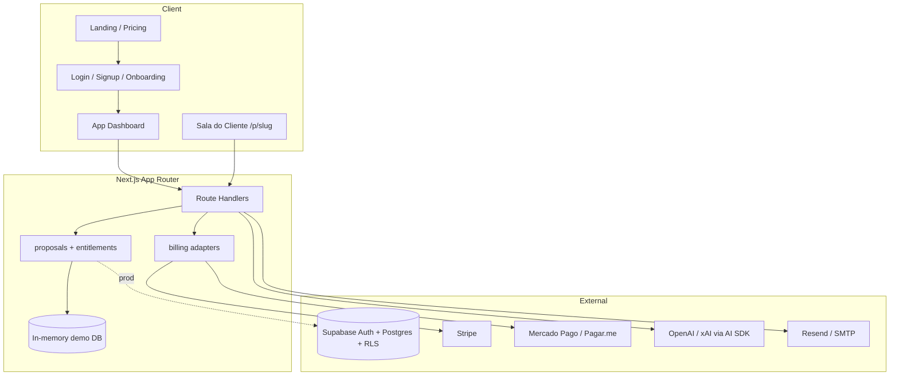

# Arquitetura ProposalRoom

## Camadas

1. **UI** — landing editorial, app shell, sala pública.
2. **API** — Zod validation, auth session, gating de plano.
3. **Billing** — provider adapter (`mock|stripe|mercadopago|pagarme`) + webhook idempotente.
4. **Domain** — briefs, propostas, aceite, lembretes, export CSV.
5. **Data** — demo in-memory agora; schema Supabase pronto em `supabase/schema.sql`.
