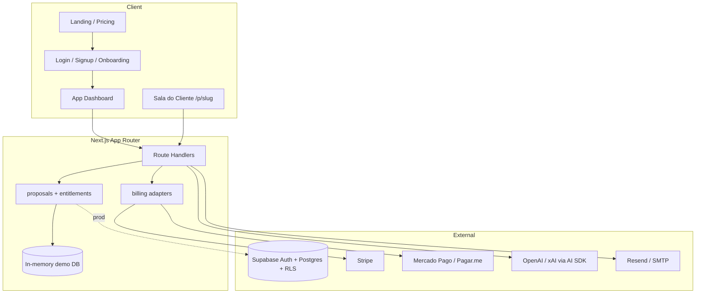

# Arquitetura ProposalRoom

## Camadas

1. **UI (App Router)** — marketing, auth, workspace app, public client room  
2. **Domain** — `src/lib/proposals.ts`, entitlements, audit log  
3. **Billing** — provider interface + mock/stripe/MP adapters + idempotent webhook router  
4. **Persistence (lab)** — SQLite via libsql (`file:.data/…` or Turso); Supabase schema documented for evolution  
5. **Auth** — scrypt password hashes + JWT session cookie (`jose`), verified in middleware  
6. **Client room** — opaque `/r/[token]` share links (legacy query redirects)  

## Lab vs production

| Concern | Lab (`DEMO_MODE=true`) | Production path |
|---------|------------------------|-----------------|
| Data | In-memory seed | Supabase Postgres + RLS |
| Billing | Mock + in-app pay simulate | Stripe/MP SDK + signed webhooks |
| Proposal gen | Local sections from brief | Optional LLM adapters |
| Auth | JWT + scrypt | Same shape; stronger secret mgmt |

See also: [TECHNICAL_DECISIONS.md](./TECHNICAL_DECISIONS.md), [TESTING.md](./TESTING.md), [DEPLOYMENT.md](./DEPLOYMENT.md), [AUDIT_REPORT.md](./AUDIT_REPORT.md).
